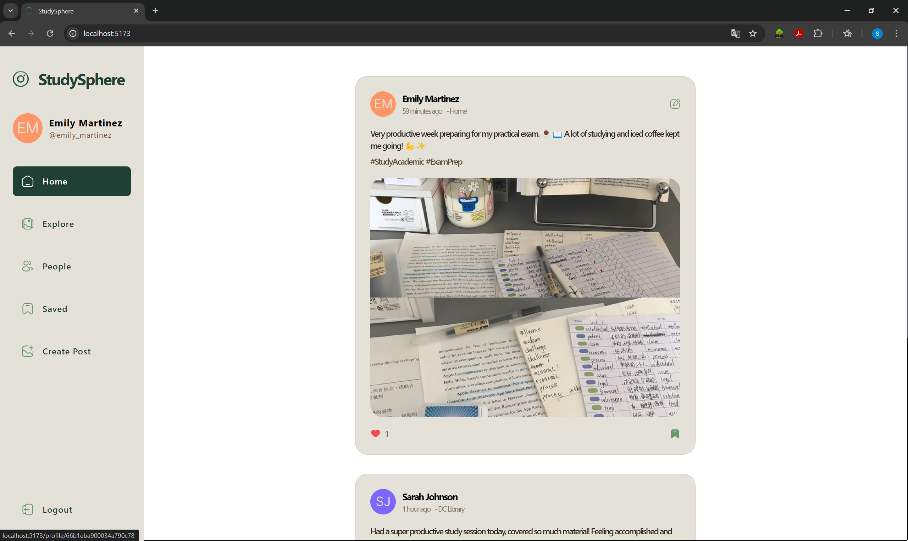
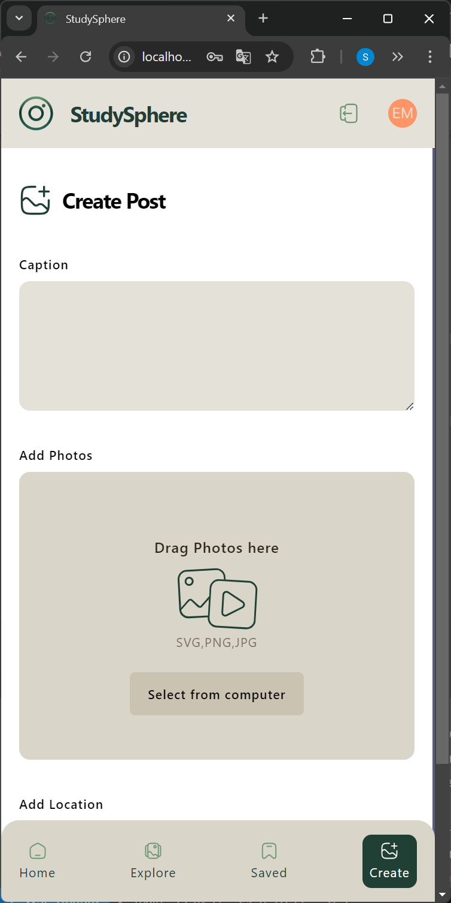

# StudySphere

StudySphere is a full-stack study social media web application, providing a platform for users to share and explore study vlogs, resources, and tips. Developed using React (Vite), TypeScript, Appwrite, Tailwind CSS, and ShadCN-UI, it offers a seamless user experience with a responsive design and efficient data management.

## Tech Stack

- **Frontend**: React (Vite), TypeScript, Tailwind CSS, ShadCN-UI
- **Backend**: Appwrite (database, authentication, file storage)
- **State Management**: React Query
- **Version Control**: Git, GitHub

## Features

- **Authentication**: Secure user authentication and authorization.
- **Post Management**: Create, edit, search, like, and save posts.
- **Search**: Search for posts and users.
- **Responsive UI**: Built with Tailwind CSS and ShadCN-UI for a mobile-friendly interface.
- **Data Management**: Optimized using React Query.
- **Backend Services**: Utilized Appwrite for authentication, database, and file storage with RESTful APIs.

## Pictures

 
 

 
 

 
 

&nbsp;&nbsp;

