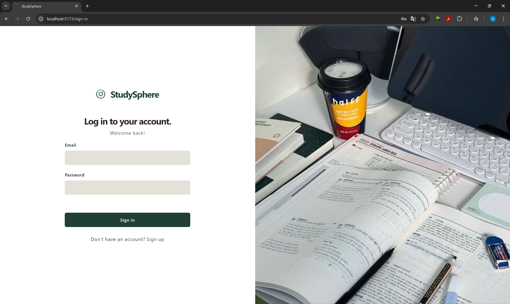
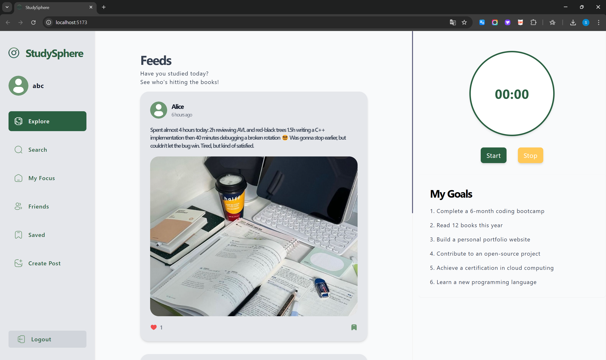
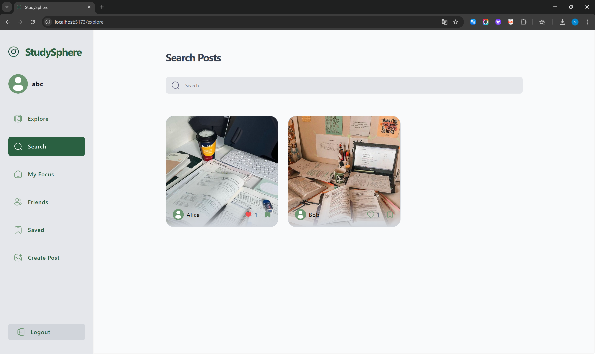
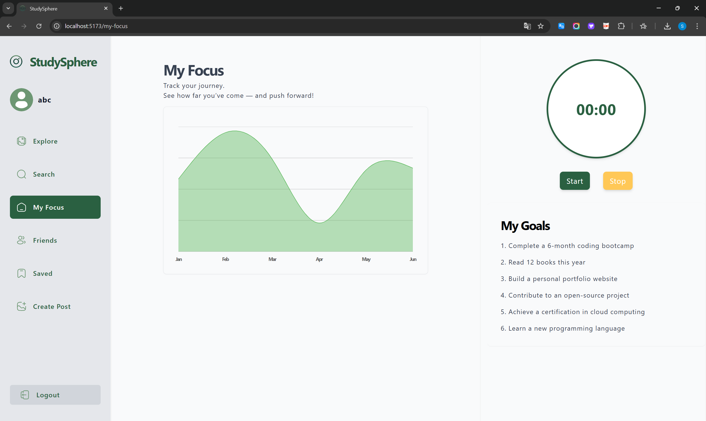
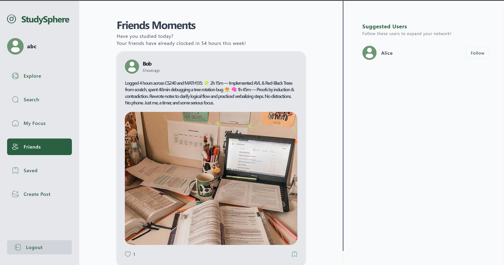
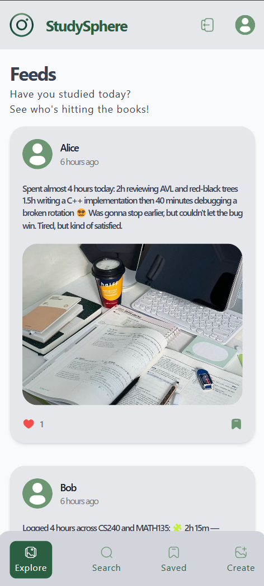
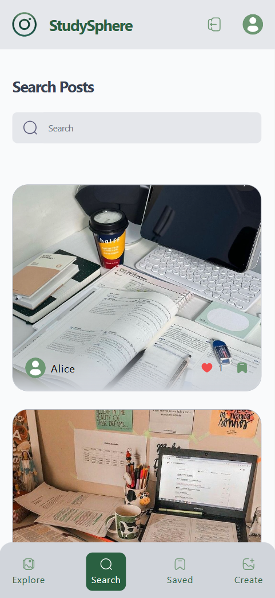

# StudySphere

**StudySphere** is a full-stack social media platform for students to share resources, stay motivated, and support each other’s study progress.  
Inspired by the idea of turning peer pressure into a positive force, the app was initially built with Appwrite and later migrated to a custom Express + PostgreSQL backend for better flexibility and control.

## Tech Stack

- **Frontend**: React, TypeScript, Tailwind CSS, ShadCN-UI  
- **Backend**: Node.js, Express, PostgreSQL, Prisma ORM, JWT  
- **Storage**: Appwrite (file storage)  
- **Tools**: Docker, Git, Jest (backend testing), React Query

---

## Features

- **🔐 Authentication**: Secure login & signup using JWT  
- **📝 Post System**: Create, like, save, and search posts  
- **👤 User Profiles**: View user display name, bio, avatar, and posts  
- **👥 Follow System**: Follow/unfollow users; explore peers’ study activity  
- **🔍 Search**: Search posts by keyword 
- **📱 Responsive UI**: Built with Tailwind CSS & ShadCN for mobile-friendly design  
- **⚙️ Lazy Loading**: Efficient frontend data fetching via React Query  
- **🧱 Modular Backend**: Refactored using Prisma ORM and controller-service pattern  
- **✅ Testing**: Backend functionality tested using Jest

---

## Database Design

The PostgreSQL schema is fully normalized, supporting users, posts, comments, likes, saves, and follow relationships as separate relational tables. Designed for integrity, scalability, and performance.

- **Foreign Key Constraints**:  
  All relations are enforced through foreign keys, ensuring referential integrity across user interactions (e.g., posts, comments, likes, follows).

- **Index Optimization**:  
  Indexed fields include `email`, `user_id`, and `post_id`, which improves the efficiency of authentication, content filtering, and relation lookups.

- **Cascade & Null Behavior**:  
  Deletion behavior is handled via Prisma relation policies (`onDelete: Cascade`, `onDelete: SetNull`) to ensure safe and consistent cleanup across entities.

- **Typed ORM Modeling**:  
  Prisma is used as the ORM, with schema-generated TypeScript types, ensuring compile-time safety and structured query logic.

---

## Backend Architecture

The backend follows a **controller–service–repository** structure using Express.js and Prisma ORM, enabling separation of concerns and long-term maintainability.

- **RESTful API Design**:  
  Endpoints are resource-oriented (`/api/auth`, `/api/post`, `/api/users`) with consistent route conventions, supporting pagination and filtering where needed.

- **Modular Codebase**:  
  Separated into directories for `routes/`, `controllers/`, `services/`, and `prisma/`, following industry-standard patterns for clarity and reusability.

- **Appwrite Integration**:  
  Files such as images are uploaded via Appwrite Storage. Due to free-tier transformation restrictions, image previews are served using `getFileView()` to bypass transform limitations.

- **Backend Testing**:  
  Core logic is tested using Jest to validate authentication, authorization, and post management behavior.

---

## Project Status

- ✅ Backend refactor with Prisma ORM and Jest completed  
- 🛠️ Frontend is currently being refactored for better modularity and user experience  
- 🚫 Image transformations (resize/crop) are currently bypassed using Appwrite’s `getFileView()` due to plan restrictions  

---

## Screenshots 

 
 

 
 

 
 

 
 

 
 

 
 

