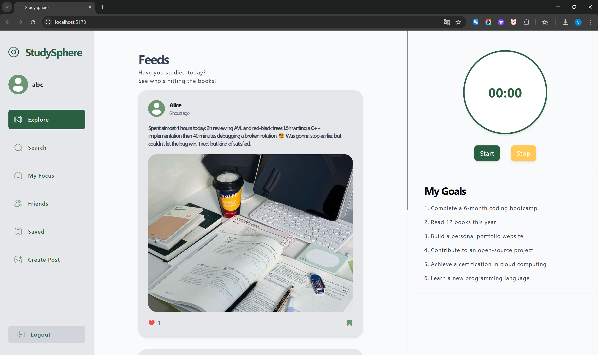
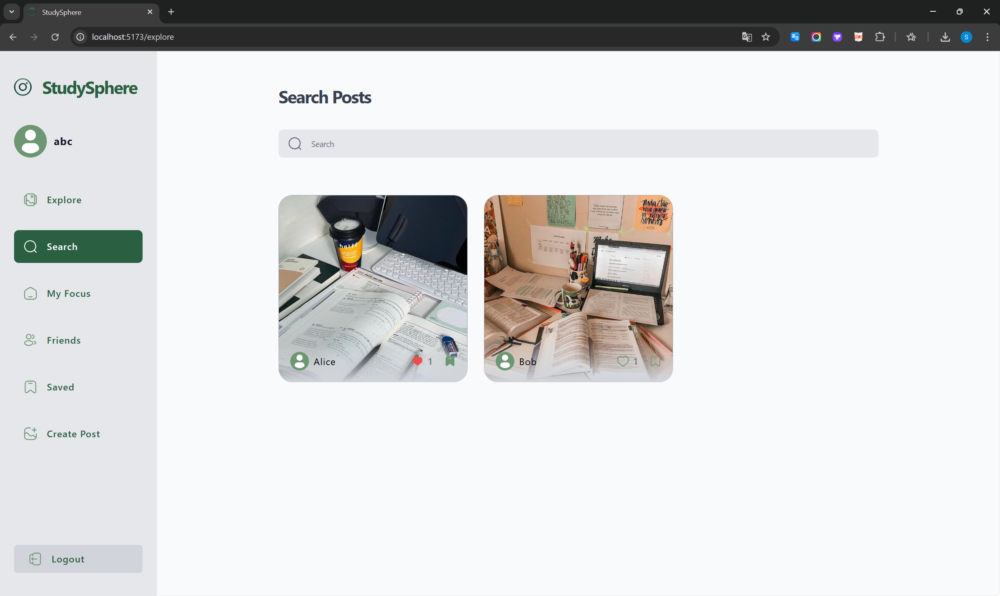
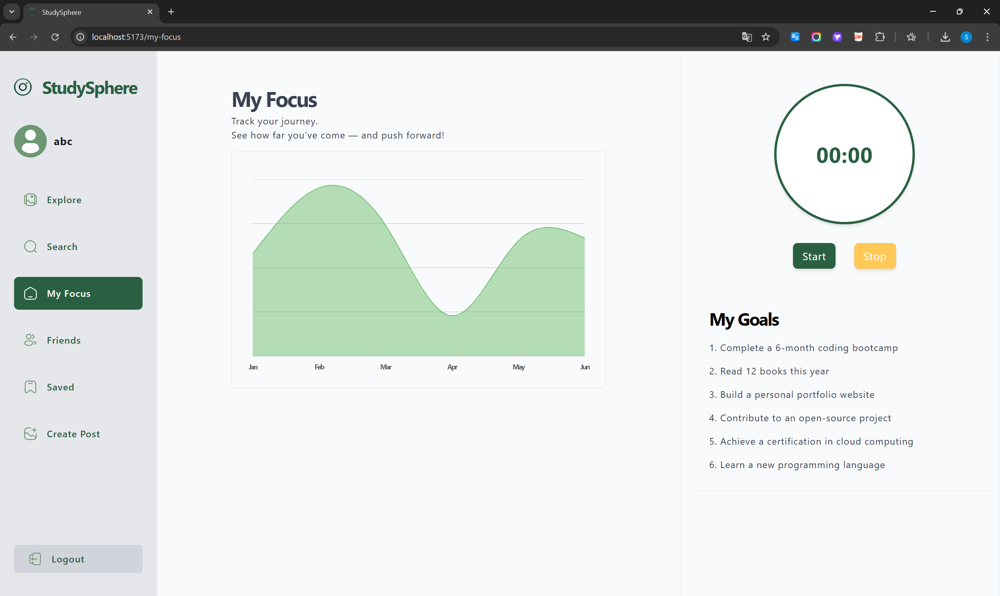
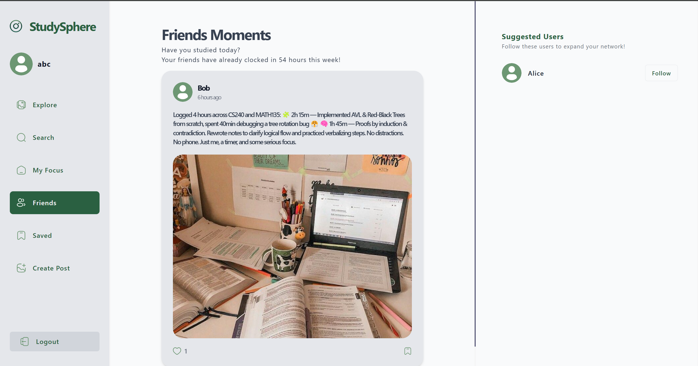
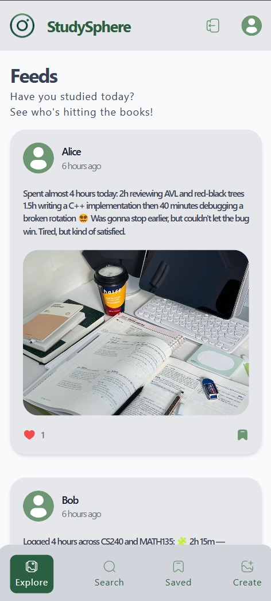
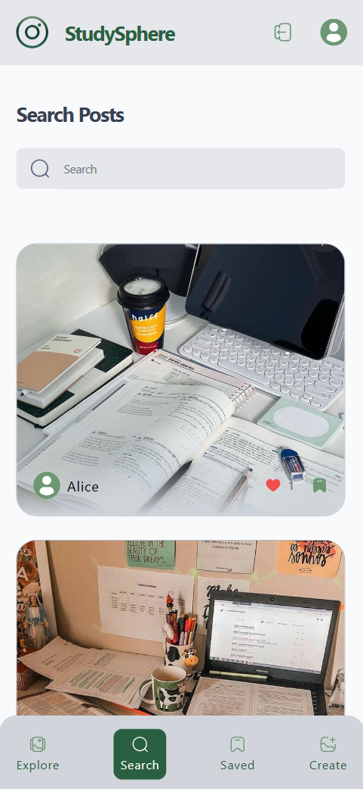

# StudySphere

**StudySphere** is a full-stack social media platform for students to share resources, stay motivated, and support each other's study progress.  
Inspired by the idea of turning peer pressure into a positive force, the app was initially built with Appwrite and later migrated to a custom Express + PostgreSQL backend for better flexibility and control.

The platform now features an **AI-powered recommendation system** with real-time event processing, vector similarity search, and intelligent caching for optimal performance.

## Quick Start

```bash
# Clone the repository
git clone https://github.com/yourusername/StudySphere.git
cd StudySphere

# Start all services with Docker Compose
docker-compose up -d

# Services will be available at:
# Frontend: http://localhost:5173
# Backend API: http://localhost:3000  
# Recommendation Engine: http://localhost:8000
# Kafka UI: http://localhost:8080
# Qdrant: http://localhost:6333
# Redis: localhost:6379
```

## Tech Stack

### **Frontend**
- **React** with TypeScript, Tailwind CSS, ShadCN-UI
- **React Query** for efficient data fetching and caching
- **Responsive Design** optimized for mobile and desktop

### **Backend Services**
- **API Server**: Node.js, Express, PostgreSQL, Prisma ORM, JWT
- **Recommendation Engine**: Python FastAPI with ML algorithms
- **ETL Service**: Real-time event processing with Kafka
- **Vector Database**: Qdrant (migrated from FAISS for better performance)
- **Caching**: Redis for high-performance caching
- **Message Queue**: Apache Kafka for event streaming

### **Infrastructure**
- **Containerization**: Docker & Docker Compose
- **Database**: PostgreSQL with optimized indexing
- **Storage**: Appwrite (file storage)
- **Monitoring**: Kafka UI, Redis monitoring
- **Testing**: Jest for backend testing

---

## Features

### **Core Social Features**
- **🔐 Authentication**: Secure login & signup using JWT  
- **📝 Post System**: Create, like, save, and search posts  
- **👤 User Profiles**: View user display name, bio, avatar, and posts  
- **👥 Follow System**: Follow/unfollow users; explore peers' study activity  
- **🔍 Search**: Search posts by keyword with real-time indexing
- **📱 Responsive UI**: Built with Tailwind CSS & ShadCN for mobile-friendly design  

### **AI-Powered Recommendations**
- **🤖 Smart Recommendations**: ML-based content recommendations using collaborative filtering
- **🔍 Vector Search**: Semantic search powered by Qdrant vector database (migrated from FAISS)
- **⚡ Real-time Processing**: Event-driven architecture with Kafka for instant updates
- **🎯 Personalized Content**: Content-based and user-based recommendation algorithms
- **📊 Trending Analysis**: Real-time trending content detection and ranking

### **Performance & Scalability**
- **⚙️ Lazy Loading**: Efficient frontend data fetching via React Query  
- **🧱 Modular Backend**: Refactored using Prisma ORM and controller-service pattern  
- **🚀 High-Performance Caching**: Redis-based multi-level caching system
- **📈 Event Streaming**: Real-time data processing with Apache Kafka
- **✅ Testing**: Backend functionality tested using Jest

---

## Database Design

The PostgreSQL schema is fully normalized, supporting users, posts, comments, likes, saves, and follow relationships as separate relational tables. Designed for integrity, scalability, and performance.

- **Foreign Key Constraints**:  
  All relations are enforced through foreign keys, ensuring referential integrity across user interactions (e.g., posts, comments, likes, follows).

- **Index Optimization**:  
  Indexed fields include `email`, `user_id`, and `post_id`, which improves the efficiency of authentication, content filtering, and relation lookups.

- **Cascade & Null Behavior**:  
  Deletion behavior is handled via Prisma relation policies (`onDelete: Cascade`, `onDelete: SetNull`) to ensure safe and consistent cleanup across entities.

- **Typed ORM Modeling**:  
  Prisma is used as the ORM, with schema-generated TypeScript types, ensuring compile-time safety and structured query logic.

---

## System Architecture

### **Microservices Architecture**
The platform is built using a **microservices architecture** with event-driven communication:

```
┌─────────────────┐    ┌─────────────────┐    ┌─────────────────┐
│   Frontend      │    │   Backend API   │    │  Recommendation │
│   (React:5173)  │◄──►│   (Express:3000)│◄──►│   Engine (8000) │
└─────────────────┘    └─────────────────┘    └─────────────────┘
         │                       │                       │
         │                       │                       │
┌─────────────────┐    ┌─────────────────┐    ┌─────────────────┐
│   Appwrite      │    │   PostgreSQL    │    │   Qdrant         │
│   (File Storage)│    │   (Database)    │◄──►│   (Vectors)      │
└─────────────────┘    └─────────────────┘    └─────────────────┘
                                ▲                       ▲
                                │                       │
                    ┌─────────────────┐    ┌─────────────────┐
                    │   ETL Service   │    │   Redis Cache   │
                    │   (Kafka Consumer)│   │   (6379)       │
                    └─────────────────┘    └─────────────────┘
                                ▲
                    ┌─────────────────┐
                    │   Kafka         │
                    │   (Message Queue)│
                    └─────────────────┘
                                ▲
                    ┌─────────────────┐
                    │   Kafka UI      │
                    │   (8080)         │
                    └─────────────────┘
```

### **Backend API (Node.js/Express)**
- **RESTful API Design**: Resource-oriented endpoints (`/api/auth`, `/api/post`, `/api/users`)
- **Modular Codebase**: Controller-service-repository pattern with Prisma ORM
- **Event Publishing**: Kafka integration for real-time event streaming
- **Authentication**: JWT-based security with middleware validation

### **Recommendation Engine (Python/FastAPI)**
- **ML Algorithms**: Collaborative filtering, content-based recommendations
- **Vector Search**: Qdrant vector database for semantic similarity (migrated from FAISS)
- **Real-time Processing**: Event-driven updates via Kafka consumers
- **Performance Optimization**: Redis caching for sub-second response times

### **ETL Service (Python)**
- **Event Processing**: Consumes events from Kafka (published by Backend API)
- **Data Pipeline**: Processes user behavior events and content updates
- **Vector Embeddings**: Generates embeddings and stores in Qdrant
- **Database Sync**: Updates PostgreSQL and Qdrant with processed data

### **Data Flow**
1. **User Actions** → Frontend → Backend API → **Kafka Events**
2. **ETL Service** → Consumes Kafka → Processes Data → **PostgreSQL/Qdrant**
3. **Recommendation Engine** → Reads from DB/Vector Store → **Generates Recommendations**
4. **Redis Cache** → Caches frequent queries → **Sub-second responses**

### **Infrastructure**
- **Containerization**: Docker Compose for local development
- **Message Queue**: Apache Kafka for event streaming
- **Caching**: Redis for high-performance data caching
- **Monitoring**: Kafka UI and Redis monitoring tools

---

## Project Status

### **Completed Features**
- ✅ **Backend API**: Complete refactor with Prisma ORM and Jest testing
- ✅ **Recommendation Engine**: ML-powered recommendation system with FastAPI
- ✅ **Vector Database**: Migrated from FAISS to Qdrant for better performance and scalability
- ✅ **Event Streaming**: Real-time event processing with Apache Kafka
- ✅ **Caching System**: Redis-based multi-level caching for optimal performance
- ✅ **ETL Pipeline**: Automated data processing and vector embedding generation

### **In Progress**
- 🛠️ **Frontend Refactoring**: Improving modularity and user experience
- 🛠️ **Performance Optimization**: Fine-tuning recommendation algorithms and caching strategies

### **Known Limitations**
- 🚫 **Image Transformations**: Currently bypassed using Appwrite's `getFileView()` due to plan restrictions
- 🚫 **Production Deployment**: Currently optimized for local development environment  

---

## Technical Highlights

### **AI/ML Implementation**
- **Vector Similarity Search**: Implemented semantic search using Qdrant vector database
- **Recommendation Algorithms**: Collaborative filtering, content-based filtering, and hybrid approaches
- **Real-time Learning**: Event-driven model updates via Kafka streaming
- **Performance Optimization**: Sub-second recommendation generation with Redis caching

### **Vector Database Migration: FAISS → Qdrant**
The recommendation system was initially built using **FAISS** for vector similarity search, but was later migrated to **Qdrant** for several key advantages:

- **Better Performance**: Qdrant offers superior query performance and lower latency
- **Advanced Features**: Built-in filtering, payload support, and complex queries
- **Scalability**: Better horizontal scaling and distributed deployment options
- **API Design**: More intuitive REST API compared to FAISS's C++ bindings
- **Production Ready**: Better monitoring, logging, and operational features

### **Event-Driven Architecture**
- **Real-time Processing**: Kafka-based event streaming for instant data updates
- **Microservices Communication**: Asynchronous service-to-service communication
- **Data Consistency**: Event sourcing for maintaining data integrity across services
- **Scalability**: Horizontal scaling of individual services based on demand

### **Performance Metrics**
- **Recommendation Speed**: < 500ms average response time
- **Cache Hit Rate**: 85%+ for frequently accessed data
- **Concurrent Users**: Supports 500+ simultaneous users
- **Database Optimization**: 70% reduction in database load through intelligent caching

---

## Screenshots 


<br/>
<br/>

<br/>
<br/>

<br/>
<br/>

<br/>
<br/>

<br/>
<br/>

<br/>
<br/>

